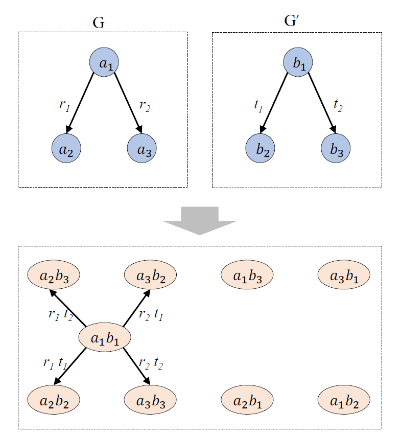
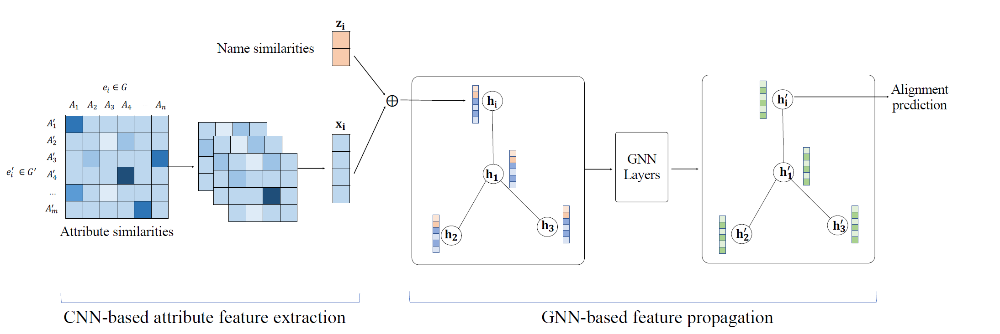

# 基于实体对嵌入的知识图谱对齐(EMNLP-2020)

## 摘要

实体对齐是为了匹配不同知识图谱中相同的实体，这是知识图谱融合和集成的关键步骤。最近，许多基于嵌入的实体对齐取得了很好的效果，这些方法首先在低维向量空间中嵌入实体，然后计算他们的向量表示距离来对齐实体。

在这种工作的基础上，我们提出了一种新的方法，直接学习实体对的嵌入表示来进行实体对齐。

我们的方法首先会在两个知识图谱上生成成对的连通图（PCG)来预测实体的等价关系。连通图的结点对应实体对，边对应关系对，然后我们要学习实体对的嵌入表示。

为了得到理想的嵌入效果，我们使用图卷积网络从实体的属性中获得实体的特征；利用图神经网络传播特征，得到实体模型的最终嵌入。5个数据集上表面我们的方法可以获得最好的结果。

## 引言

知识图谱已经被应用于多个领域。包括问答系统，推荐系统和信息抽取。大多数知识图谱构建所使用的语言和数据源不同，因此知识图谱是异质的、互补的。因此需要进行知识图谱融合，实体对齐是关键的步骤。

最近，知识图谱嵌入模型被应用于解决实体对齐问题，包括MTransE、IPTransE等这些方法首先在低维向量空间中嵌入实体，然后同计算他们的向量表示来进行实体对齐。

与传统的基于相似度的方法相比，基于嵌入的方法可以有效地对不同类型的信息进行建模，无需人工设计相似度特征即可进行实体对齐。

为了获得更精准的对齐结果，本文提出了EPEA，学习==实体对==的嵌入表示，自动提取实体属性的相似性特征，然后利用实体的结构信息进行传播。

### contributions

定义了知识图谱中成对的连通图（PCG），其节点是实体对，边是关系对，如下图所示

提出了基于卷积神经网络的相似性特征提取方法

提出边缘感知图神经网络来传播PCG的相似性特征

### 问题定义

#### Pair-wise Connectivity Graph (PCG)

构造PCG：
$$ <a,r,b>\in T \ and <{a}',{r}',{b}'>\in {T}'\Longleftrightarrow <(a,{a}'),(r,{r}'),(b,{b}')> \in \tau $$
将实体对齐任务转化为根据PCG的点嵌入判断该实体对是否同义

## 模型与方法

### 生成PCG

$<a,r,b>\in T \ \ and <{a}',{r}',{b}'>\in {T}'\Longleftrightarrow <(a,{a}'),(r,{r}'),(b,{b}')> \in \tau$

将两个知识图谱的所有实体配对为节点，用上式来生成节点之间的边。为了避免把所有的实体进行配对，控制PCG的大小，采用LSH（局部敏感哈希）来筛选有相似性的实体对，在此之前先使用下列方法来生成实体的==集合表示（set-representation）==。

1. 实体名N-gram
使用N-gram对实体的名称进行特征提取，得到一簇实体名的字符级n元作为实体的集合表示
2. 属性N-gram
将实体属性值视为字符串，使用N-gram对实体的属性进行特征提取生成特征向量再进行合并，生成实体的集合表示
3. 如果实体领域有已经对齐的种子实体，若一个实体的邻居里有种子实体，则将其特征向量集作为该实体的表示

使用**局部敏感哈希Locality-Sensitive Hashing (LSH)**(其基本的思想就是通过哈希函数将输入的高维特征矢量散列至低维特征空间，并满足在原始空间中距离较近的点经过散列之后在低维空间依然距离较近，即距离较近的点散列后碰撞的概率要远大于距离较远的点碰撞的概率。)将实体的集合表示映射到低维空间。

计算两个实体的Jaccard相似性，大于预设阈值则进行配对生成PCG的节点和边。

### 属性特征生成

具有相同或相似属性值的实体往往是等价的

- 传统的方法：手动匹配属性，然后比较相应属性值来获得相似性
- 基于属性嵌入的方法：利用属性类型或者属性值来生成属性嵌入，再和实体的结构嵌入相结合以获得更精准的实体对齐

我们的方法：从实体的属性中自动提取相似的特征

#### 基于CNN的属性特征提取

自动为PCG中每个实体对生成一个embedding，其捕获了两个实体的属性相似度

实体对$(e,{e}')$，其中$e$是$G$中的实体，${e}'$是${G}'$中的实体

$A=\{ A_1,A_2,…,A_n \}$

${A}'=\{ {A_1}',{A_2}',…,{A_m}' \}$，分别是$G$和${G}'$中所有的属性

$A_i(e)$是实体$e$的第$i$个属性值

$A_j({e}')$是实体${e}’$的第$j$个属性值

简便起见，将所有类型的属性值都视为字符串

计算相似性矩阵$M_{m \times n}$，其中元素$m_{ij}$代表属性$A_i(e)$与$A_i(e')$的相似度，采用基于N-gram的Jaccard相似度
$$
Jaccard(s,t)=\frac{|NG(s) \cap NG(t)|}{|NG(s) \cup NG(t)|}
$$
其中NG(s)表示字符串s的n元字符串集合

由于实体通常只有知识图谱所有属性中的少量属性，两个实体间重合的属性非常少，因此这个矩阵是很稀疏的，其中有很多的0。除此之外，有些属性间的相似度对于实体对齐任务也是用处不大的。为自动地找到属性值的相似度模式，使用CNN将相似矩阵转换为一个稠密向量，第$l$层计算如下：
$$
X^{(l)}_k=ReLU(W^{(l)}_k \otimes X^{(l−1)} + b^{(l)}_k)
$$
CNN的输入是两个实体的相似矩阵
$X^{l-1}$是第$l$层的输入，$X^{0}=M$
$W^{l}_k$表示第$l$层的第$k$个卷积核
$\otimes$ 表示卷积操作
每层卷积后都跟着一个最大池化，将最后一层卷积后最大池化的结果作为==该实体对的相似度向量==

#### 名称相似性特征

实体的名称或标签被看作一种特殊的属性，是判断两个实体是否等价的重要依据。为每个实体对计算一个名称相似度向量，将该向量与CNN模型生成的向量进行连接。

使用基于字符串的相似性度量

**字符串相等**
$$
z_1(s,t)=
\left\{\begin{matrix}
1  &if\ s=t \\
0  &else
\end{matrix}\right.
$$

**编辑距离**

一个字符串改变到另一个字符串的最小操作成本
$$
z_2(s,t)=1-\frac{|\{ops\}|}{\max(len(s),len(t))}
$$
$|\{ops\}|$：操作的次数

**Jaccard相似度**

两个字符串的基于N-gram的Jaccard相似度
$$
z_4(s,t)=Jaccard(s,t)=\frac{|NG(s) \cap NG(t)|}{|NG(s) \cup NG(t)|}
$$
**子字符串相似度**

找到两个字符串的最长公共子串$LCS(s,t)$
$$
z_4(s,t)=\frac{2|LCS(s,t)|}{|s|+|t|}
$$
将名称相似度与CNN生成的相似度向量进行连接形成实体对的初始特征向量

所有的初始向量将被传递到基于注意力机制的特征传播，生成最终的嵌入。

##### 基于注意力机制的特征传播

两个知识图谱中等价的实体通常也会和其他等价的实体相邻。PCG中结点之间的边反映了实体对的邻域信息。为了获得包含实体对邻域信息的特征表示，使用GNN沿着边传播实体对的属性特征。

之前的方法用于生成实体的嵌入表示，本文的方法设计了新的GNN模型，用于学习实体对的向量表示。

基于图注意力网络实际的**具有边缘感知注意力机制的残差图神经网络**，

网络具有两层，每层的输入是一组$N$个结点的$F$维度特征向量
$$
H=\{ h_1,h_2,...,h_N\} \qquad h_i \in \mathbb{R}^F
$$
也会生成$N$个${F}'$维度新的特征向量作为结点的新的表示
$$
{H}'=\{ {h_1}',{h_2}',...,{h_N}'\} \qquad {h_i}' \in \mathbb{R}^{{F}'}
$$
计算：
$$
{h_i}'=\sigma(\sum_{j\in\mathcal{N}_i} \alpha_{ij}Wh_j)
$$
$\mathcal{N}_i$是第$i$个结点的邻居结点的集合（忽略边的方向）W是一个共享矩阵，$\alpha_{ij}$是一个要学习的注意力系数，代表第$j$个结点对结点$i$的重要性

**边缘感知注意力机制（Edge-aware Attention Mechanism）**

在GAT中，注意力系数$\alpha_{ij}$是基于结点$i$和$j$的特征来计算的，作者认为两个结点之间边的类型信息也是很重要的，不可忽略。
$$
e_{ij}=LeakyReLU(a^T[Wh_i||Wh_j||t_{(i\rightarrow j)}])
$$
$t$:边类型的向量表示

$a$:神经网络的权重向量

$||$：向量的串联运算

边类型向量由它所连接的结点来计算的

$t_k$表示这种边连接的源结点和目标结点平均向量的差来表示的
$$
t_k=| \frac{1}{|S_k|}\sum_{i \in S_k}Wh_i-\frac{1}{|T_k|}\sum_{j \in T_k}Wh_j|
$$
$S_k$和$T_k$分别表示PCG中有该类型的边的出边和入边的结点集
$$
\alpha_{ij}=softmax_j(e_{ij})=\frac{exp(e_{ij})}{\sum_{k \in \mathcal{N_i}}exp(e_{ik}) }
$$
**GNN中的残差连接**

为了上实体对嵌入保留原始属性特征，作者将输入特征中的残差连接到GNN模型的输出层

#### 实验

