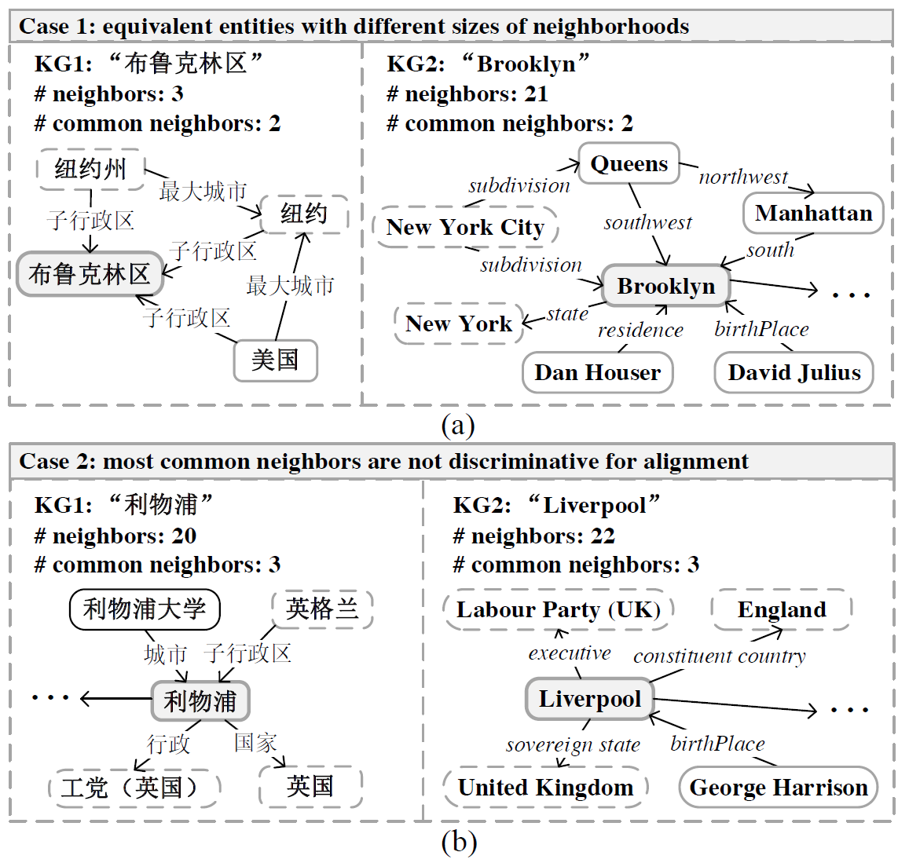

# Neighborhood Matching Network for Entity Alignment

## 摘要

知识图谱之间存在的**结构异质性**对于实体对齐任务一直是一个为解决的难题，本文提出的领域匹配网络（NMN）旨在解决该问题。

NMN有两个新颖的模块用来进行表示学习，首先使用一种新的**图采用方法**提取每个实体的领域信息，然后采用一个**交叉图领域匹配模块**对给定实体对的领域差进行联合编码。

这种策略使NMN可以有效地构建面向匹配的实体表示同时忽略对实体对齐任务有负面影响的邻居。

## 引言

最近很多用基于嵌入的方法做实体对齐，这类方法的优点是不依赖于手动构建的特征或规则，通过一个种子集可以自动地将不同知识图谱的实体映射到一个统一的向量空间，测量实体向量之间的距离来获得同义实体。

这种方法有一个重要的基本假设，即不同知识图谱的同义实体有相似的结构信息（这样才能使同义实体的嵌入表示相似），但是由于知识图谱存在不完整性与异质性，这种假设通常很难成立。

如下图所示，两个同义实体在不同知识图谱（Wikipedia的中英版本）的结构截然不同，这种情况普遍存在。

<!--  -->

对于图(a)中的同义实体邻居数差距问题，我们发现基于嵌入的方法在同义实体的邻居数的差变大的同时，其实体对齐的准确率在显著下降。

就算解决了邻居数量差的问题，图(b)还展示了另一种棘手的问题，即同义实体的共同邻居太过常见，这些共同邻居不太能够成为同义实体决定性因素，因此需要考虑另外非公共的邻居。

NMN是一个基于采样的实体对齐新框架，旨在捕获实体最具代表意义的邻居并精确估计实体对（不同知识图谱）之间邻居的相似度。

首先使用GCN对拓扑连接信息进行建模，为保留邻居中对实体对齐最有用的部分，选择性对实体的邻居进行采样。

然后关键性的问题是如何准确估计任意两个实体邻居的相似度。NMN通过设计一个关键邻居匹配模块利用跨图注意力机制来联合计算邻居（两个实体的邻居子图）的差别。

**contribution：**

1. 最先使用图采用策略来筛选一个实体对实体对齐任务最具意义的邻居；

2. 最先使用基于注意力的交叉图匹配机制来联合计算两个实体的邻居子图的差异性。
